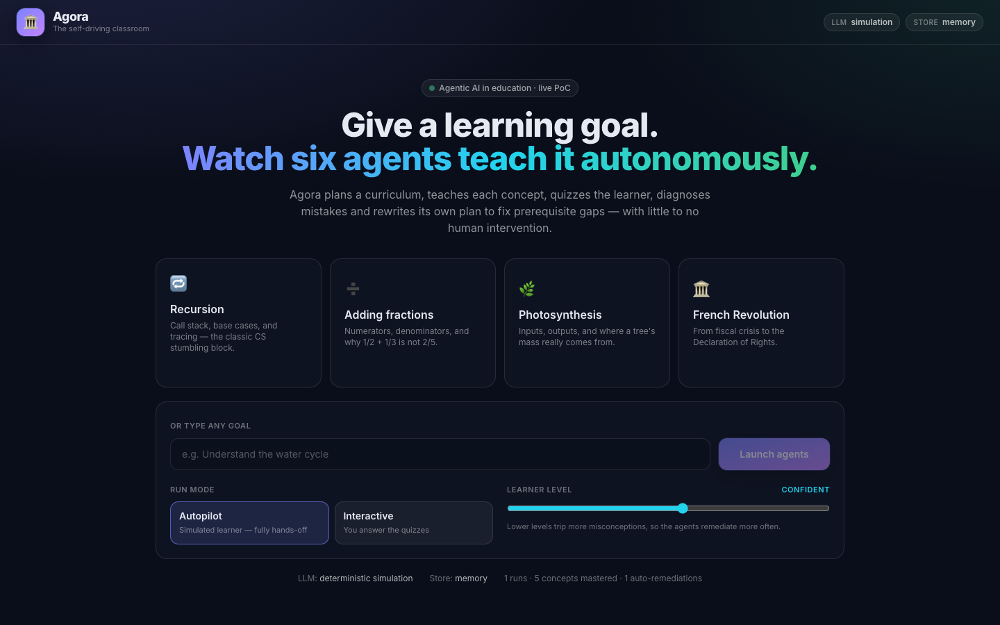
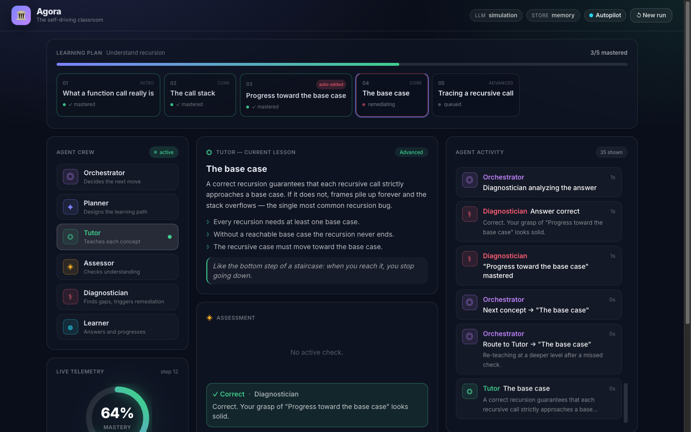
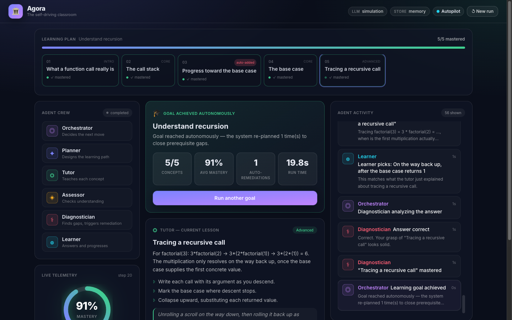

# 🏛️ Agora — The Self-Driving Classroom

> An autonomous multi-agent tutoring system. Give it a learning goal; six AI agents
> plan a curriculum, teach each concept, quiz the learner, diagnose mistakes, and
> **rewrite their own plan** to close prerequisite gaps — with little to no human
> intervention.

Built for the *Agentic AI in Education* hackathon. Node.js + Redis backend, React
control-room front-end, deployable to Scalingo in one command.



---

## Why this matters

Real tutoring is not "answer a question." A good tutor **plans** what to teach, **notices**
when a student is confused, **diagnoses the underlying gap**, and **changes the plan** to
fix it. Agora turns that loop into a system of cooperating autonomous agents.

The hard, interesting behavior is **emergent remediation**: when the Diagnostician detects
a misconception that points to a missing prerequisite, the Orchestrator inserts a remedial
micro-lesson it never originally planned, teaches it, then returns to the blocked concept.
Nobody told it to — it's a decision the system makes from the learner's state.

---

## The six agents

| Agent | Role | Autonomy it demonstrates |
|-------|------|--------------------------|
| **Orchestrator** | Decides the next action every step | Multi-step planning & control |
| **Planner** | Decomposes a goal into an ordered concept graph | Task decomposition |
| **Tutor** | Teaches a concept, adapting depth on re-teach | Adaptive generation |
| **Assessor** | Turns a concept into a gradeable check | Targeted evaluation |
| **Diagnostician** | Grades, names the misconception, finds the gap | Causal reasoning |
| **Learner** | (Autopilot) a simulated student that closes the loop | Full hands-off operation |

In **autopilot** mode the simulated Learner answers the quizzes, so the *entire* session —
plan → teach → assess → diagnose → remediate → complete — runs end-to-end with **zero human
input**. In **interactive** mode, a human answers and everything else stays autonomous.



---

## How it maps to the judging criteria

- **Autonomous agent functionality** — A closed plan→teach→assess→diagnose→adapt loop runs to
  a complex goal with no human in the loop (autopilot). The only inputs are the goal and,
  optionally, quiz answers.
- **Technical innovation** — A multi-agent orchestration with a provider-agnostic LLM layer
  and a deterministic pedagogical engine; self-rewriting plans (emergent remediation); SSE +
  Redis pub/sub real-time fan-out that survives container scaling.
- **Real-world impact** — Personalized 1:1 tutoring is the highest-leverage intervention in
  education and the hardest to scale. Agora is a concrete step toward autonomous tutors that
  adapt to each learner.
- **Theme alignment** — Agentic design is the whole architecture, not a bolt-on LLM call:
  distinct agents, an orchestration loop, and observable emergent behavior.
- **Code quality & demo** — Typed end-to-end, unit + integration + smoke tested, verified in a
  real browser, and **demo-safe**: with no API key it runs a flawless deterministic simulation,
  so the demo never depends on the network.



---

## Architecture

```
Browser (React control room)
   │  POST /api/sessions            ┌───────────────────────────────┐
   │  GET  /events/:id  (SSE) ◄─────┤  Orchestrator (autonomous loop)│
   ▼                                │   plan → teach → assess →      │
Express (Node, tsx)                 │   diagnose → remediate → done  │
   ├── routes: sessions, events,    └───┬───────────────────────────┘
   │           health, meta             │ agents: planner, tutor,
   ├── Store abstraction                │ assessor, diagnostician, learner
   │     ├── Redis (ioredis)            │
   │     └── in-memory fallback         ▼
   │        · session state        LLM layer (provider-agnostic)
   │        · replayable event log   ├── Anthropic  (if ANTHROPIC_API_KEY)
   │        · pub/sub → SSE          ├── OpenAI     (if OPENAI_API_KEY)
   │        · analytics counters     └── Simulation (deterministic, default)
```

Redis does three real jobs: durable session state + replayable per-session event logs,
cross-instance pub/sub that fans agent events to every SSE client, and global analytics
counters. With no `REDIS_URL`, an in-process store transparently takes over so the app still
runs (single instance).

See [docs/ARCHITECTURE.md](docs/ARCHITECTURE.md) for the full design and the autonomous loop
state machine.

---

## Quickstart

```bash
npm install
npm run dev          # server on :3000, Vite UI on :5173
```

Open http://localhost:5173 and click a preset goal.

No API key and no Redis are required — Agora runs in deterministic simulation + in-memory mode
out of the box. To enable live LLM tutoring, set `ANTHROPIC_API_KEY` (see `.env.example`).
To use Redis locally:

```bash
docker run -d -p 6379:6379 redis:7-alpine
REDIS_URL=redis://localhost:6379 npm run dev
```

### Production build

```bash
npm run build        # Vite → dist/public
npm start            # Express serves the built UI + API on $PORT
```

---

## Testing & verification

```bash
npm run typecheck    # tsc on web + server
npm test             # vitest: unit + integration (autonomous run asserted end-to-end)
npm run smoke        # drives a full run against a live server and checks the outcome
```

This project was verified at every layer:

- **11 unit + integration tests** — curriculum routing, deterministic learner, grading, and a
  full autopilot run asserting all concepts mastered + ≥1 emergent remediation + no answer-key
  leakage.
- **Smoke tested** against a live production server in both **in-memory** and **real Redis**
  backends (Redis keys verified written).
- **Visual E2E** in a real browser (Playwright): launcher, autopilot run to completion, and the
  interactive answer flow.
- **Reviewed** by an automated code-audit pass; the flagged correctness/robustness items were
  fixed. Production dependencies report **0 vulnerabilities**.

---

## Deploy to Scalingo (programmatic)

```bash
export SCALINGO_API_TOKEN=tk-...        # from the Scalingo dashboard → API tokens
./scripts/deploy-scalingo.sh agora-demo osc-fr1
```

The script installs the CLI if needed, creates the app, provisions the **Redis addon**, sets
env, pushes via git, scales the `web` container, tails logs, and runs the smoke test against the
live URL. A Scalingo `postdeploy` hook ([scripts/postdeploy-check.mjs](scripts/postdeploy-check.mjs))
verifies the Redis connection on every deploy. App manifest: [app.json](app.json), `Procfile`.

CI ([.github/workflows/ci.yml](.github/workflows/ci.yml)) typechecks, tests, builds, and
smoke-tests the production server on every push.

---

## Tech choices, briefly

- **`tsx` in production** instead of a TypeScript compile step — fewer moving parts, nothing to
  break on the buildpack; CI still typechecks with `tsc --noEmit`.
- **Provider-agnostic LLM via `fetch`** (no SDK) — light, swappable, and it degrades to the
  deterministic engine on any error, so a run never fails on a network hiccup.
- **SSE over WebSockets** — simpler, proxy-friendly, and backed by Redis pub/sub so it scales
  horizontally.
- **Deterministic simulation as a first-class mode** — the demo is repeatable and offline-safe.

---

## A note on how this was built

Fittingly for a project about agentic AI, Agora was itself built by an agentic workflow:
Claude Code orchestrated the architecture and integration, delegated isolated UI components to
the Codex CLI, ran parallel sub-agents for code review and security audit, and verified every
layer autonomously before shipping.

## License

MIT — see [LICENSE](LICENSE).
